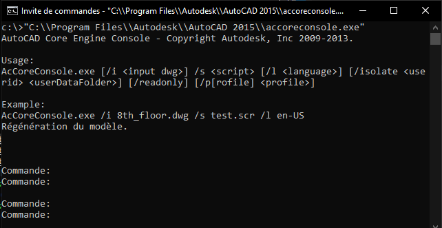
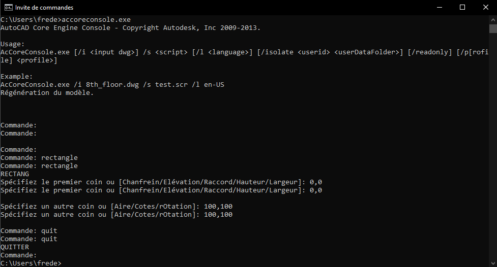

# ACCORE

Depuis le version 2013, AutoCAD dispose d'une version de ligne de commande d'AutoCAD qui peut vous aider à accélérer considérablement le traitement par lots des dessins.
Non supporté officiellement par Autodesk, il n'y a pas de documentation, je vous propose donc une petite immersion. 

## Principes d'utilisation
### Ligne de commande

Dans le dossier d'installation d'AutoCAD, vous pouvez trouver le "AccoreConsole.exe". 

Copier/Coller (findfile "accoreconsole.exe") dans la barre de commande Autocad :

vous retourne le chemin d'accoreconsole.exe

"C:\\Program Files\\Autodesk\\AutoCAD 2015\\accoreconsole.exe"

Ici pour une 2015.

Copier/Coller ce chemin dans la console Windows (touche Windows + R, tapez "cmd") puis Entrée.

Le simple fait de l'exécuter dans la console, affichera les commutateurs de ligne de commande qui peuvent être utilisés avec lui, un exemple d'utilisation et ouvre une session Autocad sur Dessin1.dwg.

 

Il accepte six commutateurs de ligne de commande :

1) /i : permet de spécifier le chemin du fichier de dessin sur lequel exécuter le fichier de script

2) /s : permet de spécifier le chemin d'accès au fichier de script.

3) /l : Si des packs de langue sont installés, vous avez le choix d'invoquer la version linguistique d'accoreconsole. Les commandes du fichier de script peuvent alors être dans l'une des langues que vous avez installées sur votre système.(optionnel)

4) /isolate : utilisé pour empêcher les modifications apportées aux variables système d'affecter AutoCAD normal.(optionnel)

5) /readonly : permet de spécifier que le fichier DWG doit être ouvert en lecture seule (optionnel, apparu avec la version 2015)

6) /p[rofile] permet de spécifier le nom d'un profil AutoCAD à utiliser lors de l'ouverture du fichier DWG. (optionnel, apparu avec la version 2015)

Pour raccourcir nos futurs scripts, nous pouvons rajouter au Path Windows le dossier comme ceci.

``` setx Path "%Path%;C:\Program Files\Autodesk\AutoCAD 2015" ```

Redémarrer la console pour la prise en compte. Maintenant, accoreconsole.exe suffira.

Je tiens à prévenir tout de suite, que travailler avec accore, c'est le faire sans filet. Aucun message d'erreur, pas de retours en arrière possible. Il est donc conseillé de faire des essais, et de sauvegarder son travail en prévention. Nous éviterons aussi de modifier des fichiers de façon récursive (dans les dossiers situé dans un dossier).

Mais avant cela testons comment nous pouvons dessiner directement dans la console. Un rectangle de 100x100.



Plusieurs constats:

  - Double les messages de Commande. (plutôt désagréable)

  - Accepte les commandes françaises. (une surprise)

  - Cause en Français.

  - Ne demande pas d'enregistrer avant de quitter. 

Pour l'utilisation directe dans la console, je vais m'arretter la, car c'est en script que c'est le plus intérréssant.

## .bat et .scr 

Le principe, le ".bat" démarre accoreconsole dans la console Windows, en lui donnant le chemin du fichier à éditer, puis éxécute le script inscrit dans le ".scr".
Les fichiers batch (".bat") et les fichiers de script (".scr") sont des fichiers de commandes qui permettent d'automatiser des tâches en exécutant une séquence de commandes dans un ordre précis.
Ce sont de simples fichiers texte (utf-8) que vous pouvez éditer avec Notepad ou votre éditeur de texte préféré.

Plaçons un dwg nommé Test.dwg (avec un objet et un calque Test courant) dans un dossier "C:\Data".

Créons un fichier texte dans le même dossier que nous enregistrerons en "Test.scr" dans lequel nous écrivons le script.

  - Rendre le calque "0" courant.

  - Faire un zoom étendu.

  - Enregistrer le dessin.

```
(setvar 'clayer "0")
zoom
et
_qsave

```

Puis le "Test.bat".

Qui lance accoreconsole.exe, avec le dessin "C:\Data\Test.dwg" et applique le script "C:\Data\Test.scr".

```accoreconsole.exe /i C:\Data\Test.dwg /s C:\Data\Test.scr```

Si vous n'utilsez jammais de ".bat", vous pouvez vérifier avec un clic droit/Propriétés que le Type de fichiers soit bien Fichier de commande Windows (.bat). Si ce n'est pas le cas, ouvrez cmd.exe et saisissez ceci.
```
assoc .bat=cmdfile
ftype cmdfile=C:\Windows\System32\cmd.exe /k "%1" %*
```
On double clic sur Test.bat
La console s'ouvre pendant une seconde et se referme.
Si on ouvre Test.dwg, le calque courant est "0" et un zoom étendu à bien été éffectué.

### Root

  https://www.houseofbim.com/posts/son-of-a-batch-autocad-core-console-through-lisp/
  